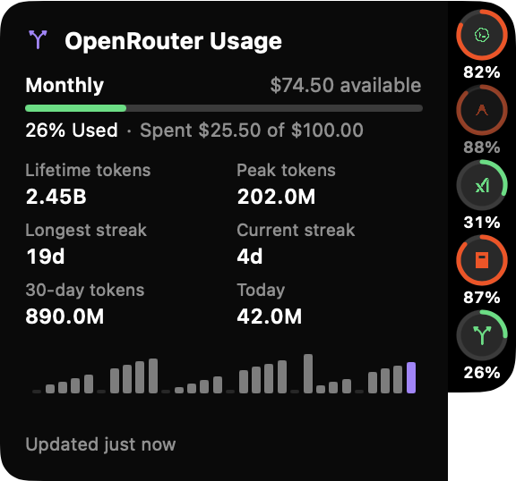

<p align="center">
  
</p>

<h1 align="center">meterusage</h1>

<p align="center">
  <strong>Native macOS menu-bar and floating side-notch HUD for monitoring your AI coding quotas.</strong>
</p>

<p align="center">
  
  
  
  
</p>

---

### ⚡ TL;DR

**meterusage** brings all your AI coding allowances, token burn rates, and rate-limit reset timers together into a clean macOS menu bar item and an interactive floating side-notch HUD.

* **Supported Providers**: OpenAI Codex, Google Antigravity, Claude Code, OpenRouter, Grok, and OpenCode Go.
* **100% Private & Zero Setup**: No accounts to connect, no passwords entered. Reads already-authenticated local CLI sessions and local SQLite/JSON logs on your machine.
* **Smart Pacing & Resets**: Live burn-rate indicators (*well paced*, *on pace*, *burning fast*) and exact countdowns to quota rollovers.
* **Rich Telemetry & Heatmaps**: 26-week GitHub-style activity heatmaps, 7-day sparklines, and token telemetry histograms.
* **Floating Side Notch**: Dockable, collapsible hardware-style HUD with hover detail cards that flip automatically to stay on screen.

```bash
git clone https://github.com/pekth/meterusage.git && cd meterusage && ./Scripts/make-app.sh && open dist/
```
> Drag `MeterUsage.app` to **Applications**. That's it!

---

## 📸 Showcase

### Menu Bar
Compact system tray glyph or full per-provider clusters `[mark] %` with service status and headroom color coding:

<p align="center">
  
</p>

### Floating Side Notch Panel
A dockable, collapsible HUD pinned to the edge of your screen. Hovering any provider ring expands a dedicated detail card with rate limits, pacing, token telemetry, and activity history:

<p align="center">
  
  &nbsp;&nbsp;&nbsp;&nbsp;
  
</p>

### Popover Dashboard
Click the menu bar mark anytime to inspect full rate-limit details, multi-window countdowns, and 26-week activity heatmaps:

<p align="center">
  
  &nbsp;
  
  &nbsp;
  
</p>

<sub>Screenshots show the real app in demo mode (`METERUSAGE_DEMO=1`) — all numbers and names are synthetic.</sub>

---

## 🔍 Provider Matrix

| Provider | Live Cloud Quota | Local Activity & Tokens | Reset Countdowns | 26-Week Heatmap | Source Mechanism |
|---|:---:|:---:|:---:|:---:|---|
| **Codex** | ✅ | ✅ | ✅ | ✅ | Local JSON-RPC via `codex app-server --stdio` |
| **Antigravity** | ✅ | ✅ | ✅ | — | CLI `/usage` & local conversation SQLite |
| **Claude Code** | Optional* | ✅ | ✅* | ✅ | Local session JSONL streams (`limits[]` file optional) |
| **OpenRouter** | ✅ | ✅ | ✅ | — | Public account API & `/api/v1/activity` telemetry |
| **Grok** | ✅ | ✅ | ✅ | — | CLI auth bearer token & session summaries |
| **OpenCode Go** | ✅ | ✅ | ✅ | — | Local `opencode db` read-only queries |

<small>*Claude publishes no public quota API; meterusage reads an on-disk JSON snapshot if a local companion writes one (see [docs/COMPANION.md](docs/COMPANION.md)).</small>

---

## 🚀 Key Features

* **Menu-Bar Provider Clusters** — Display each enabled provider as a `[mark] %` cluster. The mark is color-coded by real-time service health, and the percentage is tinted by remaining quota headroom. Cold starts retain the last known reading so you never see an empty bar.
* **Floating Side Notch HUD** — Fixed-black, hardware-like collapsible strip. Hovering a ring expands a docked detail card with smooth spring animations. Features auto-flip positioning (switches left/right depending on screen position) and right-click controls (*Keep open*, *Refresh now*, *Hide*).
* **Burn-Rate & Pacing Analysis** — Computes linear quota burn against time remaining in 5-hour and weekly windows, tagging usage as *well paced*, *on pace*, or *burning fast*.
* **26-Week Activity Heatmaps** — GitHub-style activity matrix inside Codex and Claude cards with Day, Week, or Cumulative views, accompanied by 7-day sparklines.
* **Token Telemetry & 30-Day Histograms** — Multi-column token breakdowns (lifetime, 30-day, peak, today) and activity histograms.
* **In-App Reset Credit Actions** — View earned reset credits and countdowns to expiry. Consume Codex reset credits directly within the popover or side notch card with a single click.
* **Opt-In Threshold Alerts** — Native macOS notifications when any window crosses 80% or 95% used, or when an earned reset credit is within 24 hours of expiry.
* **Scriptable JSON CLI** — Run `meterusage json` in terminal or CI scripts to inspect current quotas programmatically without launching the GUI.

---

## 🔒 Privacy & Architecture

meterusage is built from the ground up to respect developer privacy:
* **No Network Man-in-the-Middle**: Reuses the authenticated CLI sessions already on your Mac.
* **No Prompts or Code Read**: Reads only numeric session metadata, token tallies, and timestamps. Never opens prompt contents, tool payloads, or file diffs.
* **No Telemetry / Analytics**: Zero outgoing telemetry calls.
* **Sandboxed & Inspectable**: Full privacy architecture documented in [docs/PRIVACY.md](docs/PRIVACY.md).

---

## 🛠️ Requirements & Building

### Requirements
* macOS 13 Ventura or later
* Xcode Command Line Tools (`xcode-select --install`)
* Any of your installed CLI tools (`codex`, `agy`, `opencode`, `grok`, or Claude Code)

### Build & Run
```sh
# Clone & build native app bundle
git clone https://github.com/pekth/meterusage.git
cd meterusage
./Scripts/make-app.sh && open dist/

# Run unit tests
swift test

# Launch in safe Demo Mode (synthetic data for screenshots)
METERUSAGE_DEMO=1 swift run meterusage
```

> **Note**: No Apple Developer paid account required — the app is ad-hoc signed. macOS may prompt you to allow the first run in **System Settings → Privacy & Security**.

---

## 📄 License & Disclaimer

* **License**: [MIT](LICENSE)
* **Disclaimer**: Independent open-source project. Not affiliated with or endorsed by OpenAI, Anthropic, Google, xAI, or OpenRouter.
