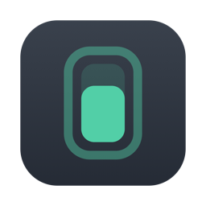
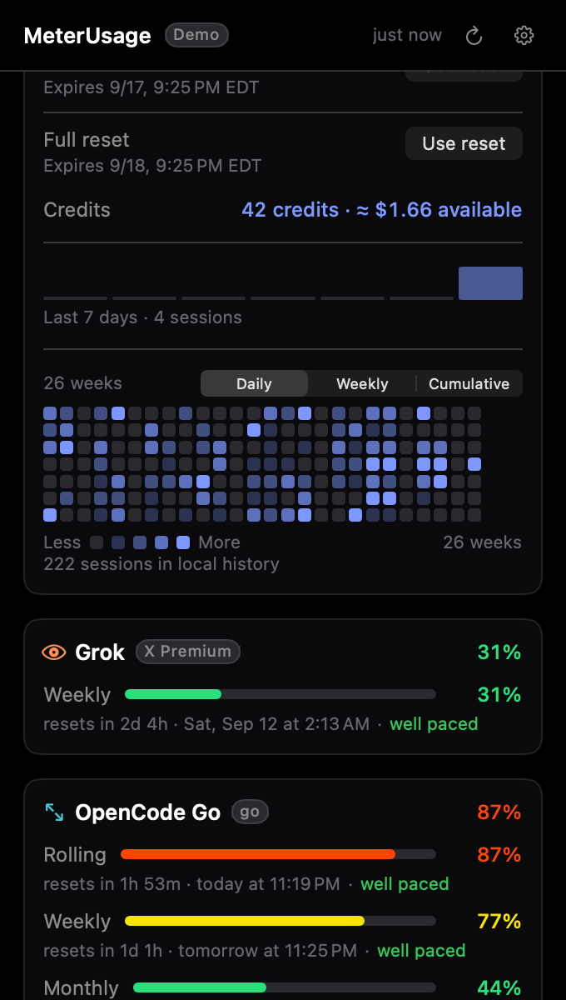
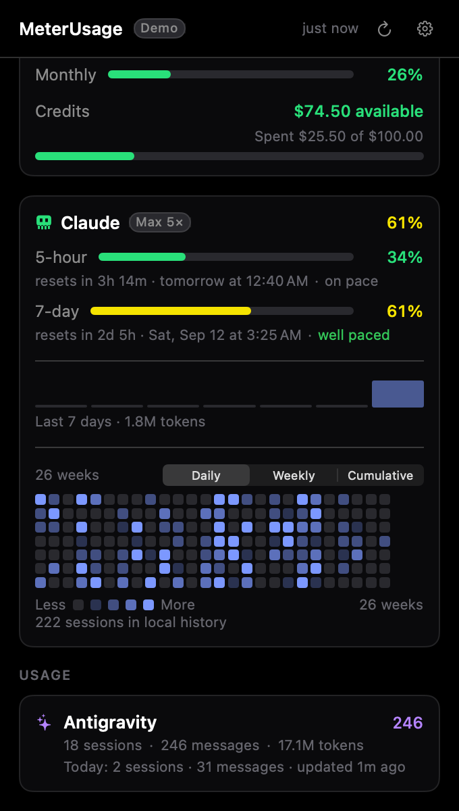

# meterusage

A macOS menu-bar app that shows how much of your AI coding quota you have left.

<br clear="left">


Codex, OpenRouter, Antigravity, Grok, OpenCode Go, and Claude Code all leave usage signals
in different places. meterusage puts the useful numbers in your menu bar — each
enabled provider as its own `[mark] %` cluster, with the marks colour-coded by
service status and the figures by quota headroom.


  

<sub>Screenshots are the real app in demo mode (`METERUSAGE_DEMO=1`) — every
number is synthetic, which is why the popover is badged **Demo**.</sub>

```sh
git clone https://github.com/pekth/meterusage.git
cd meterusage
./Scripts/make-app.sh && open dist/
```

Drag `MeterUsage.app` to Applications. That's the whole setup — no account to
connect and no key-entry screen. OpenRouter uses an existing
`OPENROUTER_API_KEY` or local OpenRouter key file when present.

## What you get

- **Menu-bar provider clusters** — every provider you switch on appears in the
  system tray as its own compact `[mark] %` cluster, so you can see Codex,
  Grok, OpenCode Go, and friends at a glance. Each mark is that provider's
  real logo, tinted by service status, and the percentage is tinted by quota
  headroom. Hover the tray item for a per-provider usage and status summary
  plus the last-refresh time. The tray and the side notch panel are separate
  surfaces: the tray is **compact by default** (one small app mark, so the
  notch panel carries the usage instead), and **Compact menu bar** in Settings
  brings the full per-provider clusters back. A first-run welcome page in the
  popover explains where usage lives.
- **Per-provider tray selection** — the "Menu bar" section of Settings picks
  which providers show as clusters in the tray, independent of which appear in
  the popover. OpenRouter is always excluded (pay-as-you-go, no quota window).
- **Live Codex quota** — general weekly limits, model-specific limits such as
  GPT-5.3-Codex-Spark, reset-credit expiry details, credit balance, and plan,
  read through the `codex` CLI you're already signed in to. Codex credits also
  show their approximate dollar equivalent at 2,500 credits = $100. The compact
  system-tray figure shows consumed usage; the Codex popover shows remaining
  headroom.
- **Live OpenRouter usage** — authenticated dollar spend, remaining account
  balance, and the optional daily/weekly/monthly key spending limit.
- **Live Grok quota** — the current allowance window (weekly on the X Premium
  tier, monthly on others) and the share already used, read from the same
  billing service the Grok CLI uses. The OIDC token is re-read from
  `~/.grok/auth.json` on every refresh, so a `grok` re-login never leaves the
  app reading a stale credential until relaunch.
- **Local provider usage** — Antigravity token totals and session/message
  counts, Grok session/message counts, and OpenCode Go token totals, message
  counts, and estimated local cost.
- **Claude quota bars *(optional)*** — shown only when a local companion has
  already written a usage snapshot. When that file includes a `limits[]`
  array (session / weekly_all / weekly_scoped), meterusage surfaces those
  windows — including a Fable `weekly_scoped` bar. If the writer still emits
  only legacy `five_hour` / `seven_day` fields, you get those instead. No
  Fable bar appears until the writer actually emits `limits[]`; most
  statusline writers discard it, so [docs/COMPANION.md](docs/COMPANION.md)
  shows how to pass it through.
- **A 26-week heatmap** of daily usage — Codex activity (sessions per day)
  inside the Codex quota card, Claude activity (tokens per day) inside the
  Claude quota card. Each grid can be viewed by **day, week, or cumulative
  total**, and hovering a cell instantly previews the date and its tokens. A
  master **Show heatmap** switch plus per-provider Codex/Claude heatmap
  toggles in Settings control what is shown.
- **7-day sparklines** — Codex and Claude quota cards lead with a compact
  last-week trend line (tokens, or sessions for Codex), so "am I burning
  faster than usual?" is a glance question rather than a grid exploration.
- **Quota threshold alerts *(optional)*** — opt-in local notifications when a
  quota window crosses 80% or 95% used, or an earned reset credit is about to
  expire within 24 hours. Off by default; the **Alerts** section of Settings
  opts in and requests notification permission at that moment, never at
  launch. Alerts fire once per crossing, not every refresh.
- **Provider marks everywhere** — every provider is identified by its real
  mark throughout the popover and Settings, not a colour dot. In service
  status rows the mark is tinted by severity, so health stays readable
  without colour alone.
- **Per-source retry backoff** — a source that keeps failing (outage,
  offline) is skipped by scheduled refreshes with a capped exponential
  backoff instead of being hammered every cycle. Explicit refreshes always
  try every source, and permanent conditions (CLI not installed, not signed
  in) never back off.
- **Copy diagnostics** — the Maintenance section of Settings copies a
  privacy-safe summary of every provider's status to the clipboard, so a bug
  report can say "quota: unavailable (failed)" without pasting anything
  sensitive.
- **Colour-coded usage and status** — quota headroom uses calm/warning/alert
  bands, while provider identity and written service-severity badges remain
  understandable without relying on colour alone.
- **Scriptable CLI** — `meterusage json` prints every enabled provider's
  limits as stable JSON and exits. Agents, scripts, and editor integrations
  read quota without touching the UI:

  ```sh
  meterusage | jq '.providers[] | select(.provider == "codex")'
  ```

- **Opt-in side notch panel** — a floating strip of per-provider usage rings on
  the right edge of the screen, just below the menu bar. Every ring, progress
  bar, and detail caption uniformly displays percentage used (`% Used`). Hovering
  any provider expands a dedicated detail card aligned beside that provider
  with an arrow beak, showing its rate limit windows, progress bars, reset
  countdowns, token usage summaries, and service status. A settings gear icon
  remains tucked away and only appears when hovering at the bottom of the
  strip, keeping the panel minimal and compact. The strip can be dragged
  anywhere, and the position is remembered across relaunches and screen changes.
  Off by default; the **Side notch panel** switch in Settings turns it on.
- **Notification Center widgets** — one widget per provider plus an
  automatic "worst provider" widget. Small = headline figure; medium =
  per-window bars with reset countdowns (current + weekly for a pinned
  provider). Widgets read only the
  snapshot file the app rewrites after every refresh — no provider CLIs,
  no network. Requires a full Xcode install at build time (see below).
- **Per-provider display settings** — hide any provider you do not use; Claude,
  Antigravity, and Grok start hidden, while Codex is the primary entry.
  Choices are saved locally and survive relaunches and app reinstalls.
- **Service health at the top** for Codex and Claude from their public status
  pages. Providers without a usable public status feed are omitted.

## How it works

meterusage reuses the CLI logins already on your machine. Codex and Claude
credentials stay in their own clients; OpenRouter uses an existing key only
for its aggregate usage and balance requests. It does **not** call Anthropic for quota and
does **not** read any Claude credentials.

| What | How | Needs network |
|---|---|---|
| Codex quota | Spawns `codex app-server --stdio` and calls `account/rateLimits/read` over JSON-RPC with the experimental rate-limit detail capability enabled. This includes general/model-specific windows and earned reset-credit expiry details. The subprocess authenticates itself. | Yes, by the CLI |
| OpenRouter quota | Calls the documented `/api/v1/key` and `/api/v1/credits` endpoints with an existing `OPENROUTER_API_KEY` or supported local key file. Only aggregate usage, account balance, limit, and reset cadence are retained. | Yes |
| Grok quota | Calls the billing endpoint the Grok CLI itself uses (`cli-chat-proxy.grok.com/v1/billing`), sending only the OIDC bearer token re-read from `~/.grok/auth.json` on each refresh. Only the allowance percent, period type, and reset time are retained; no prompts or model requests are sent. | Yes |
| Codex activity | Counts sessions per day from `~/.codex/sessions/**/*.jsonl`, reading only the start timestamp on each rollout's first event (the file's modification date as a fallback). Session payloads are never opened. | No |
| Claude activity | Streams `~/.claude/projects/**/*.jsonl` and sums usage fields. | No |
| Claude quota *(optional)* | Reads an on-disk usage JSON if a companion already wrote one (e.g. `~/.claude/claudewatch-usage.json` or `~/.claude/meterusage-usage.json`). Parses legacy windows and, when present, `limits[]` (including Fable `weekly_scoped`). Does not fetch Anthropic quota. | No |
| Antigravity quota | Runs the agy CLI's own non-interactive `/usage` output inside the same container setup the user's agy wrapper uses, and reads only the model group, window label, percent remaining, and reset timestamp of each row. No prompt is sent: slash commands are handled locally by the CLI. The backend quota refresh happens inside the CLI. | Yes, by the CLI |
| Antigravity usage | Decodes token totals, session/message counts, and rolling usage windows from agy's per-conversation SQLite stores under `~/.gemini/antigravity-cli/conversations/`, preferring the native location and falling back to the `antigravity-config` container volume when agy is containerised. Only numeric usage fields and turn timestamps inside the stores are decoded; prompt text, tool payloads, and workspace paths are never read. Older installs without conversation stores fall back to `history.jsonl`, where only the `conversationId` and `timestamp` fields of each line are used and token totals stay unknown. | No |
| Grok usage | Reads session summaries under `~/.grok/sessions/**/summary.json`; only session dates and message counts are used. | No |
| OpenCode Go usage | Runs the local `opencode db --format json` command with a read-only query over numeric session usage fields and timestamps. Message bodies are never queried. | No |
| Codex service health | Public OpenAI Statuspage JSON, filtered to Codex, CLI, and login components. | Yes |
| Claude service health | Public Claude Statuspage JSON, filtered to Claude/API components. | Yes |
| Update check | At most once a day, fetches the public GitHub Releases `latest` endpoint and compares the tag to the running version. A newer release shows a dismissible banner in the popover; its Install button downloads the release zip, verifies its SHA-256 against the digest published in the release metadata, swaps the bundle, and relaunches — only on click. A system notification also fires when notification permission is already granted. Unauthenticated; no identifier or usage data is sent. Off-switch: Settings → General → "Check for updates". | Yes |

### Reset actions per provider

- **Codex** — earned reset credits can be consumed in-app ("Use reset"): the
  CLI's JSON-RPC API exposes both the credit list and a redeem call.
- **Grok** — Grok offers a "redeem usage limit reset" feature, but only on
  the account/web side. The CLI billing endpoint this app reads carries no
  reset field and no redeem call (last verified 2026-08-23 against the live
  endpoint; see the note in `GrokQuotaSource.swift`). Grok's weekly pool
  resets automatically, so no action is offered. If the CLI API ever exposes
  reset credits, surface them the way Codex's are (`QuotaSection` /
  `QuotaResetConsumer`).

### Why there's no "Sign in with Claude" button

Anthropic publishes no supported API for Claude subscription quota — the only
sanctioned channel is Claude Code's own statusline. A third-party app *could*
lift Claude Code's OAuth token out of the Keychain and call an undocumented
endpoint using Anthropic's first-party client id. meterusage deliberately
doesn't, because that impersonates the official client and can break without
notice.

So the honest split: **Codex, OpenRouter, and Grok quotas are live from the
cloud; Antigravity, Grok, OpenCode Go, and Claude activity are computed from
local data; Claude quota bars are optional and file-driven.** meterusage never
talks
to Anthropic for quota. OpenRouter's existing key is used only for its
aggregate account endpoints and is never displayed or logged. If a local
companion writes a usage snapshot, its counts light up from that file alone.
When the Claude snapshot includes `limits[]`, those windows — including Fable —
take precedence over legacy keys; display depends on what the writer actually
emits.

See [docs/PRIVACY.md](docs/PRIVACY.md) for the full boundary and how each claim
is enforced by tests and hooks rather than promised in prose.

## Requirements

- macOS 13 Ventura or later
- Xcode command-line tools (`xcode-select --install`)
- Optional: [`codex`](https://github.com/openai/codex) CLI, signed in, for live
  Codex quota
- Optional: `OPENROUTER_API_KEY` or a local OpenRouter key file, for live
  OpenRouter usage
- Optional: [`opencode`](https://opencode.ai/), for OpenCode Go local usage
- Optional: Grok CLI (signed in), for Grok session history and the live
  allowance window
- Optional: the Antigravity (agy) CLI for Antigravity token usage; containerised agy installs also need Docker or Podman
- Optional: Claude Code, for Claude activity and the Claude heatmap

Missing any provider is fine. Its row shows a calm empty state, and Settings
can hide providers that are not installed or not relevant to you.

## Build from source

```sh
swift build            # debug binary
swift test             # unit tests
./Scripts/make-app.sh  # assembles dist/MeterUsage.app, ad-hoc signed
./Scripts/make-icon.sh # regenerates the app icon (only when the design changes)
```

The Notification Center widget is built by `xcodebuild` from
`MeterUsageWidget.xcodeproj` — a full Xcode install is needed for it, not just
the command line tools. Without one, `make-app.sh` still builds the app and
skips the widget with a warning: a widget extension hand-wrapped from a
SwiftPM binary registers but crashes at load and never appears in the gallery,
so there is no fallback build for it.

The icon is generated rather than hand-drawn: `Scripts/make-icon.swift` renders
it from the same geometry the menu-bar glyph uses, so the two stay the same
mark. Both the 1024×1024 master and the `.icns` are committed, so a fresh clone
builds a complete bundle without running the generator.

No third-party dependencies. No Apple Developer account needed — the app is
ad-hoc signed, so macOS will ask you to confirm the first launch via
**System Settings → Privacy & Security**.

### Demo mode

Run the real UI against synthetic data — useful for screenshots, or for
poking at the app without either CLI installed:

```sh
METERUSAGE_DEMO=1 swift run meterusage
```

A **Demo** badge appears in the popover header so fake numbers are never
mistaken for real ones. See [docs/DEMO.md](docs/DEMO.md).

## Cost figures are estimates

Costs are derived locally from token counts against a rate table in
[`Pricing.swift`](Sources/MeterUsage/Services/Pricing.swift). Published rates
change and the table drifts — cost captions show the table's snapshot month
(e.g. "est. Jul 2026 rates") so the vintage is never hidden, and the snapshot
date is a machine-readable constant that must move when rates are updated.
Treat every number here as awareness, not billing truth — your provider's
dashboard is the only source of record.

## Contributing

Issues and PRs welcome. Two things to know before you open one:

- A pre-commit hook scans staged diffs for tokens, JWTs, private keys, and
  absolute `/Users/<name>/` paths, and fails closed. Enable it with
  `git config core.hooksPath .githooks`.
- Test fixtures must be synthetic. Use `testuser` or `example` for paths and
  invented values everywhere else — never paste a real captured payload.

If you're reporting something that involves a live credential, describe its
shape and location. Don't paste it.

## Not affiliated

meterusage is an independent open-source project. It is not affiliated with,
endorsed by, or supported by Anthropic or OpenAI. "Claude" and "Codex" are
their respective owners' marks, used here only to say what the tool reads.

## License

[MIT](LICENSE)
