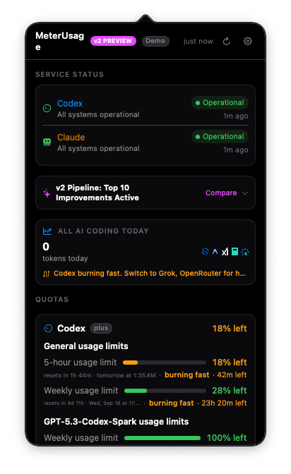

# meterusage

A macOS menu-bar app that shows how much of your AI coding quota you have left.

Claude Code and Codex both burn through rate limits you can't see until you hit
them. meterusage puts the number in your menu bar.




<sub>Screenshots are the real app in demo mode (`METERUSAGE_DEMO=1`) — every
number is synthetic, which is why the popover is badged **Demo**.</sub>

```sh
git clone https://github.com/pekth/meterusage.git
cd meterusage
./Scripts/make-app.sh && open dist/
```

Drag `MeterUsage.app` to Applications. That's the whole setup — no account to
connect, no API key to paste, no statusline to install.

## What you get

- **Live Codex quota** — 5-hour and weekly windows, credit balance, and plan,
  read through the `codex` CLI you're already signed in to.
- **Claude activity** — tokens and estimated cost broken down per model, so
  every model you actually run is visibly accounted for. Computed from your
  own local transcripts.
- **Claude quota bars *(optional)*** — shown only when a local companion has
  already written a usage snapshot. When that file includes a `limits[]`
  array (session / weekly_all / weekly_scoped), meterusage can surface those
  windows — including a Fable `weekly_scoped` bar. If the writer still emits
  only legacy `five_hour` / `seven_day` fields, you get those instead. No
  Fable bar appears until the writer actually emits `limits[]` (or an
  equivalent weekly breakdown).
- **A 26-week heatmap** of daily usage.
- **Service health** from Anthropic's public status page.

## How it works

meterusage reuses the CLI logins already on your machine. It never handles a
credential itself. It does **not** call Anthropic for quota and does **not**
read any Claude credentials.

| What | How | Needs network |
|---|---|---|
| Codex quota | Spawns `codex app-server --stdio` and calls `account/rateLimits/read` over JSON-RPC. The subprocess authenticates itself. | Yes, by the CLI |
| Claude activity | Streams `~/.claude/projects/**/*.jsonl` and sums usage fields. | No |
| Claude quota *(optional)* | Reads an on-disk usage JSON if a companion already wrote one (e.g. `~/.claude/claudewatch-usage.json` or `~/.claude/meterusage-usage.json`). Parses legacy windows and, when present, `limits[]` (including Fable `weekly_scoped`). Does not fetch Anthropic quota. | No |
| Service health | Public Statuspage JSON. | Yes |

### Why there's no "Sign in with Claude" button

Anthropic publishes no supported API for Claude subscription quota — the only
sanctioned channel is Claude Code's own statusline. A third-party app *could*
lift Claude Code's OAuth token out of the Keychain and call an undocumented
endpoint using Anthropic's first-party client id. meterusage deliberately
doesn't, because that impersonates the official client and can break without
notice.

So the honest split: **Codex quota is live from the cloud. Claude activity is
computed locally. Claude quota bars are optional and file-driven.** meterusage
never talks to Anthropic for quota and never opens a credential file. If a
local companion (ClaudeWatch, or a future helper) writes a usage snapshot,
quota bars light up from that file alone. When the snapshot includes
`limits[]`, those windows — including Fable — take precedence over legacy
keys; today's claudewatch writer may still ship only the legacy fields, so
Fable display depends on the writer, not on meterusage inventing data.

See [docs/PRIVACY.md](docs/PRIVACY.md) for the full boundary and how each claim
is enforced by tests and hooks rather than promised in prose.

## Requirements

- macOS 13 Ventura or later
- Xcode command-line tools (`xcode-select --install`)
- Optional: [`codex`](https://github.com/openai/codex) CLI, signed in, for live
  Codex quota
- Optional: Claude Code, for local activity data

Missing either CLI is fine. Those sections show a calm empty state instead of
an error — meterusage is useful with just one of them installed.

## Build from source

```sh
swift build            # debug binary
swift test             # unit tests
./Scripts/make-app.sh  # assembles dist/MeterUsage.app, ad-hoc signed
```

No third-party dependencies. No Apple Developer account needed — the app is
ad-hoc signed, so macOS will ask you to confirm the first launch via
**System Settings → Privacy & Security**.

### Demo mode

Run the real UI against synthetic data — useful for screenshots, or for
poking at the app without either CLI installed:

```sh
METERUSAGE_DEMO=1 swift run meterusage
```

A **Demo** badge appears in the popover header so fake numbers are never
mistaken for real ones. See [docs/DEMO.md](docs/DEMO.md).

## Cost figures are estimates

Costs are derived locally from token counts against a rate table in
[`Pricing.swift`](Sources/MeterUsage/Services/Pricing.swift). Published rates
change and the table drifts. Treat every number here as awareness, not billing
truth — your provider's dashboard is the only source of record.

## Contributing

Issues and PRs welcome. Two things to know before you open one:

- A pre-commit hook scans staged diffs for tokens, JWTs, private keys, and
  absolute `/Users/<name>/` paths, and fails closed. Enable it with
  `git config core.hooksPath .githooks`.
- Test fixtures must be synthetic. Use `testuser` or `example` for paths and
  invented values everywhere else — never paste a real captured payload.

If you're reporting something that involves a live credential, describe its
shape and location. Don't paste it.

## Not affiliated

meterusage is an independent open-source project. It is not affiliated with,
endorsed by, or supported by Anthropic or OpenAI. "Claude" and "Codex" are
their respective owners' marks, used here only to say what the tool reads.

## License

[MIT](LICENSE)
