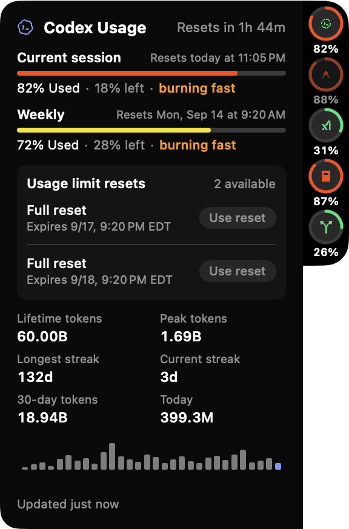
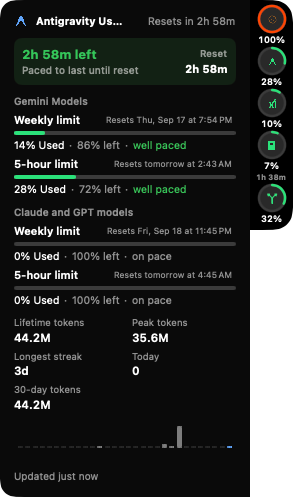
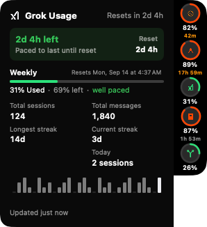
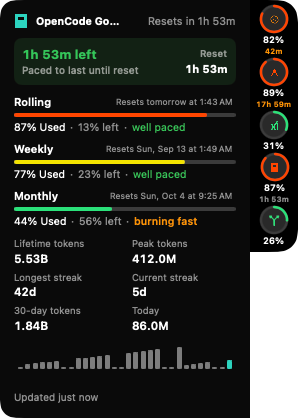
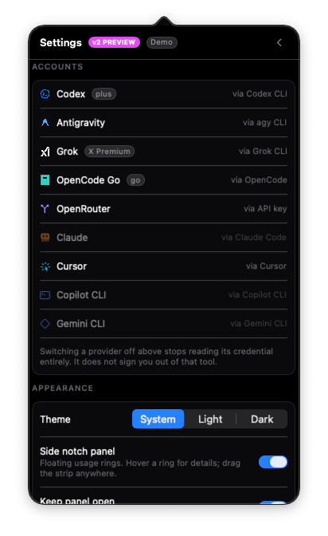
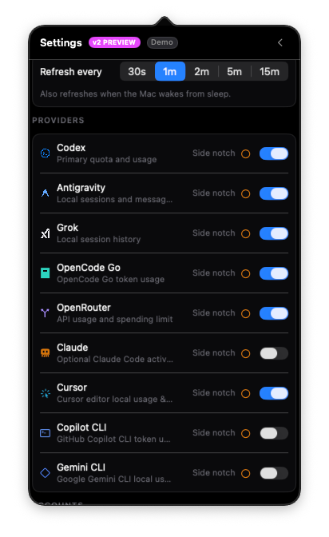

<p align="center">
  
</p>

<h1 align="center">meterusage</h1>

<p align="center">
  <strong>Native macOS menu-bar and floating side-notch HUD for monitoring your AI coding quotas.</strong>
</p>

<p align="center">
  
  
  
  
</p>

---

### ⚡ TL;DR

**meterusage** brings all your AI coding allowances, token burn rates, and rate-limit reset timers together into a clean macOS menu bar item and an interactive floating side-notch HUD.

* **Broad Provider Coverage**: OpenAI Codex, Google Antigravity, Claude Code, OpenRouter, Grok, OpenCode Go, Cursor, GitHub Copilot CLI, and Google Gemini CLI.
* **Ambient Time-to-Empty**: Live depletion velocity against reset deadlines (`~47m left at current pace` / `Paced to last until reset`) directly in the menu bar and side notch.
* **Burn Attribution & Context Waste**: Real-time token breakdown by project, model, and turns for the active window, plus cache-hit efficiency % and long-chat flags.
* **Durable Daily History**: Local summary store surviving CLI transcript purges and session cleanup.
* **100% Private & Zero Setup**: No accounts to connect, no passwords entered. Reads already-authenticated local CLI sessions and local SQLite/JSON logs on your machine.
* **Agent Budget API**: Machine-readable JSON CLI (`meterusage json`) exporting burn rates, pacing, and time-to-empty for autonomous AI agents.

```bash
git clone https://github.com/pekth/meterusage.git && cd meterusage && ./Scripts/make-app.sh && open dist/
```
> Drag `MeterUsage.app` to **Applications**. That's it!

---

## 📸 Showcase

### Ambient Time-To-Empty & Side Notch HUD
A dockable, collapsible HUD pinned to the edge of your screen. Hovering any provider ring expands a dedicated detail card with rate limits, ambient time-to-empty, pacing diagnostics, and token telemetry:

<p align="center">
  
  &nbsp;&nbsp;&nbsp;&nbsp;
  
</p>

<p align="center">
  
  &nbsp;&nbsp;&nbsp;&nbsp;
  
</p>

### Menu Bar & Popover Dashboard
Click the menu bar mark anytime to inspect full rate-limit details, multi-window countdowns, and 26-week activity heatmaps:

<p align="center">
  
  &nbsp;
  
  &nbsp;
  
</p>

<sub>Screenshots show the app in demo mode (`METERUSAGE_DEMO=1`) — all numbers and names are synthetic.</sub>

### Settings: Accounts & Providers
Toggle providers on or off, choose refresh cadence, and switch themes:

<p align="center">
  
  &nbsp;&nbsp;&nbsp;&nbsp;
  
</p>

---

## 🔍 Provider Matrix

| Provider | Live Cloud Quota | Local Activity & Tokens | Reset Countdowns | 26-Week Heatmap | Source Mechanism |
|---|:---:|:---:|:---:|:---:|---|
| **Codex** | ✅ | ✅ | ✅ | ✅ | Local JSON-RPC via `codex app-server --stdio` |
| **Antigravity** | ✅ | ✅ | ✅ | — | CLI `/usage` & local conversation SQLite |
| **Claude Code** | Optional* | ✅ | ✅* | ✅ | Local session JSONL streams (`limits[]` file optional) |
| **OpenRouter** | ✅ | ✅ | ✅ | — | Public account API & `/api/v1/activity` telemetry |
| **Grok** | ✅ | ✅ | ✅ | — | CLI auth bearer token & session summaries |
| **OpenCode Go** | ✅ | ✅ | ✅ | — | Local `opencode db` read-only queries |
| **Cursor** | ✅ | ✅ | ✅ | — | Local sqlite state & token usage cache |
| **Copilot CLI** | ✅ | ✅ | ✅ | — | Local GitHub CLI auth token & token telemetry |
| **Gemini CLI** | ✅ | ✅ | ✅ | — | Local Gemini CLI session state |

<small>*Claude publishes no public quota API; meterusage reads an on-disk JSON snapshot if a local companion writes one (see [docs/COMPANION.md](docs/COMPANION.md) and [`Scripts/claude-companion.sh`](Scripts/claude-companion.sh)).</small>

---

## 🚀 Key Features

* **Ambient Time-to-Empty** — Dynamic ETA calculations (`~47m left at current pace` / `Paced to last until reset`) directly in the menu bar and side notch, warning you of rapid burn cliffs before limits are reached.
* **Window Burn Attribution** — Explains *"Where did my tokens go?"* by decomposing the active window's token consumption by project, model, and message turns.
* **Context Waste & Cache Hints** — Diagnostic metadata highlighting cache hit rate %, average tokens per turn, and long-chat flags ($\ge 10$ turns or $\ge 100\text{k}$ tokens) to curb silent context waste.
* **Durable Daily History Store** — Preserves daily token tallies, estimated spend, and peak window utilization in a durable local database (`~/Library/Application Support/MeterUsage/durable-daily-history.json`) that survives CLI transcript pruning.
* **Unified AI Coding Strip** — High-level summary card in the popover showing all AI coding today (tokens, weekly volume, and estimated USD spend) across all active providers.
* **Floating Side Notch HUD** — Fixed-black, hardware-like collapsible strip. Hovering a ring expands a docked detail card with smooth spring animations. Features auto-flip positioning (switches left/right depending on screen position).
* **Cross-Provider Headroom Failover** — Instant suggestions when a provider is burning fast or near exhaustion, identifying which alternative model has headroom available.
* **Agent Budget API** — Run `meterusage json` to export machine-readable quota telemetry, burn velocity, pacing status, and seconds-to-empty for autonomous AI agents.
* **26-Week Activity Heatmaps** — GitHub-style activity matrix inside Codex and Claude cards with Day, Week, or Cumulative views, accompanied by 7-day sparklines.
* **Opt-In Pacing Alerts** — Native macOS notifications when an active window crosses critical burn velocity or drops below 30 minutes to empty.

---

## 🔒 Privacy & Architecture

meterusage is built from the ground up to respect developer privacy:
* **No Network Man-in-the-Middle**: Reuses the authenticated CLI sessions already on your Mac.
* **No Prompts or Code Read**: Reads only numeric session metadata, token tallies, and timestamps. Project identifiers are strictly directory basenames. Never opens prompt contents, tool payloads, or file diffs.
* **No Telemetry / Analytics**: Zero outgoing telemetry calls.
* **Sandboxed & Inspectable**: Full privacy architecture documented in [docs/PRIVACY.md](docs/PRIVACY.md).

---

## 🛠️ Requirements & Building

### Requirements
* macOS 13 Ventura or later
* Xcode Command Line Tools (`xcode-select --install`)
* Any of your installed CLI tools (`codex`, `agy`, `opencode`, `grok`, `cursor`, `copilot`, `gemini`, or Claude Code)

### Build & Run
```sh
# Clone & build native app bundle
git clone https://github.com/pekth/meterusage.git
cd meterusage
./Scripts/make-app.sh && open dist/

# Run unit tests
swift test

# Launch in safe Demo Mode (synthetic data for showcase and testing)
METERUSAGE_DEMO=1 open dist/MeterUsage.app --args --demo
```

### Agent Budget CLI
To consume quota telemetry programmatically in scripts or agents:
```sh
meterusage json
```
Outputs structured JSON including `remaining_percent`, `resets_at`, `pacing`, `burn_rate`, and `eta_seconds`.

---

## 📄 License & Disclaimer

* **License**: [MIT](LICENSE)
* **Disclaimer**: Independent open-source project. Not affiliated with or endorsed by OpenAI, Anthropic, Google, xAI, Microsoft, or OpenRouter.
