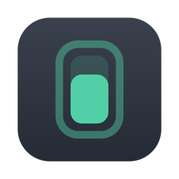
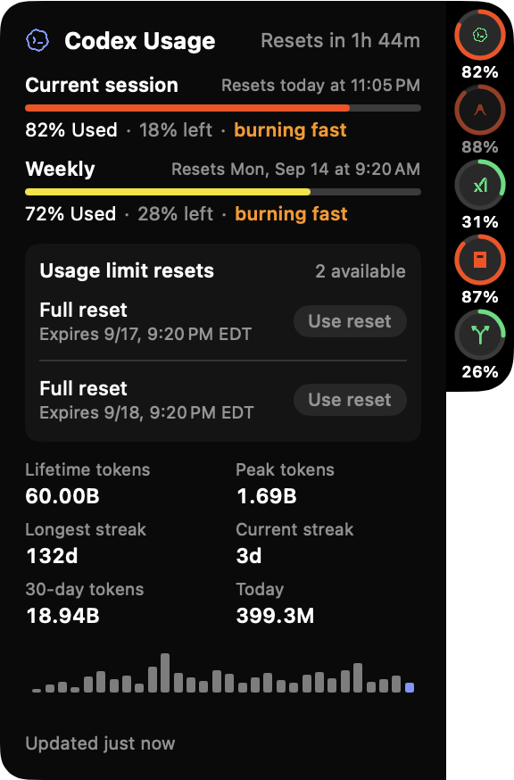
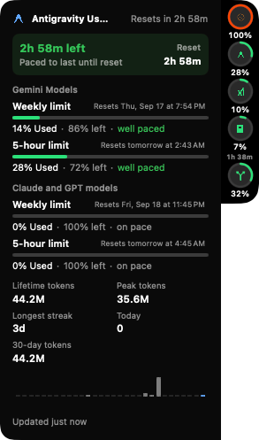
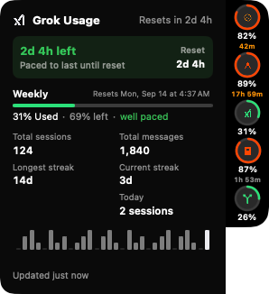
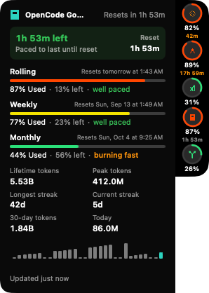
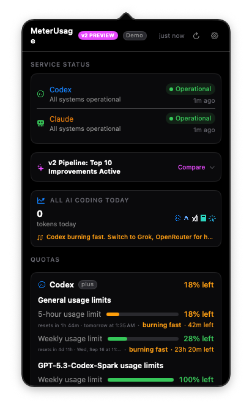
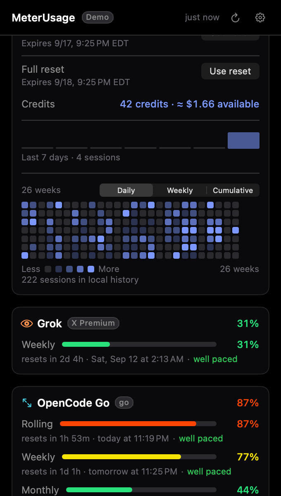
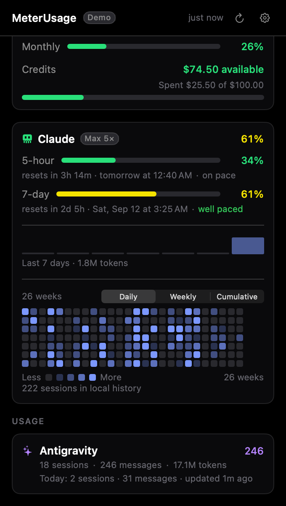
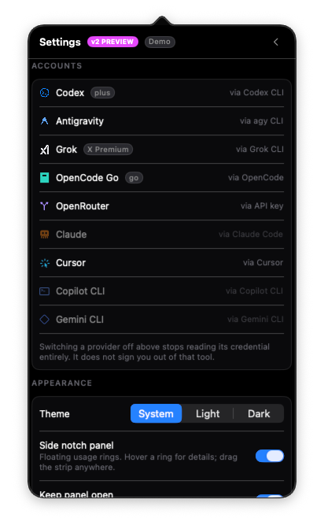
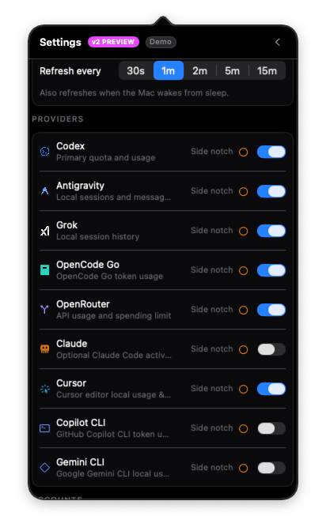

<p align="center">
  
</p>

<h1 align="center">meterusage</h1>

<p align="center">
  <strong>Native macOS menu-bar and floating side-notch HUD for monitoring your AI coding quotas.</strong>
</p>

<p align="center">
  
  
  
  
</p>

---

### ⚡ TL;DR

**meterusage** brings all your AI coding allowances, token burn rates, and rate-limit reset timers together into a clean macOS menu bar item and an interactive floating side-notch HUD.

* **Broad Provider Coverage**: OpenAI Codex, Google Antigravity, Claude Code, OpenRouter, Grok, OpenCode Go, Cursor, GitHub Copilot CLI, and Google Gemini CLI.
* **Second-Account Meters**: Hold two Codex or Claude Code accounts? Each one gets its own independent meter row — own quota windows, plan badge, history, and alerts — instead of a merged guess. See [Second accounts](#second-accounts).
* **Ambient Time-to-Empty**: Live depletion velocity against reset deadlines (`~47m left at current pace` / `Paced to last until reset`) directly in the menu bar and side notch.
* **Burn Attribution & Context Waste**: Token breakdown by project, model, and turns over the last 7 days across every token-bearing provider, plus cache-hit efficiency % and long-chat flags.
* **Durable Daily History**: Local summary store surviving CLI transcript purges and session cleanup.
* **100% Private & Zero Setup**: No accounts to connect, no passwords entered. Reads already-authenticated local CLI sessions and local SQLite/JSON logs on your machine.
* **Agent Budget API**: Machine-readable JSON CLI (`meterusage json`) exporting burn rates, pacing, and time-to-empty for autonomous AI agents.

```bash
git clone https://github.com/pekth/meterusage.git && cd meterusage && ./Scripts/make-app.sh && open dist/
```
> Drag `MeterUsage.app` to **Applications**. That's it!

---

## 📸 Showcase

### Ambient Time-To-Empty & Side Notch HUD
A dockable, collapsible HUD pinned to the edge of your screen. Hovering any provider ring expands a dedicated detail card with rate limits, ambient time-to-empty, pacing diagnostics, and token telemetry. The panel is anchored by the strip's top-right corner, so switching providers never moves the strip ([`docs/SIDE-NOTCH.md`](docs/SIDE-NOTCH.md)):

<p align="center">
  
  &nbsp;&nbsp;&nbsp;&nbsp;
  
</p>

<p align="center">
  
  &nbsp;&nbsp;&nbsp;&nbsp;
  
</p>

### Menu Bar & Popover Dashboard
Click the menu bar mark anytime to inspect full rate-limit details, multi-window countdowns, and 26-week activity heatmaps:

<p align="center">
  
  &nbsp;
  
  &nbsp;
  
</p>

<sub>Screenshots show the app in demo mode (`METERUSAGE_DEMO=1`) — all numbers and names are synthetic.</sub>

### Settings: Accounts & Providers
Toggle providers on or off, choose refresh cadence, and switch themes and the accent colour:

<p align="center">
  
  &nbsp;&nbsp;&nbsp;&nbsp;
  
</p>

---

## 🔍 Provider Matrix

| Provider | Live Cloud Quota | Local Activity & Tokens | Reset Countdowns | 26-Week Heatmap | Source Mechanism |
|---|:---:|:---:|:---:|:---:|---|
| **Codex** | ✅ | ✅ | ✅ | ✅ | Local JSON-RPC via `codex app-server --stdio` |
| **OpenAI API** | N/A | API totals | N/A | N/A | Organization Usage and Costs APIs; Admin key required |
| **Anthropic API** | N/A | API totals | N/A | N/A | Organization Usage and Cost Admin APIs; Admin key required |
| **Antigravity** | ✅ | ✅ | ✅ | — | CLI `/usage` & local conversation SQLite |
| **Claude Code** | Optional* | ✅ | ✅* | ✅ | Local session JSONL streams (`limits[]` file optional) |
| **OpenRouter** | ✅ | ✅ | ✅ | — | Public account API & `/api/v1/activity` telemetry |
| **Grok** | ✅ | ✅ | ✅ | — | CLI auth bearer token & session summaries |
| **OpenCode Go** | ✅ | ✅ | ✅ | — | Local `opencode db` read-only queries |
| **Cursor** | ✅ | ✅ | ✅ | — | Local sqlite state & token usage cache |
| **Copilot CLI** | ✅ | ✅ | ✅ | — | Local GitHub CLI auth token & token telemetry |
| **Gemini CLI** | ✅ | ✅ | ✅ | — | Local Gemini CLI session state |

<small>*Claude publishes no public quota API; meterusage reads an on-disk JSON snapshot if a local companion writes one (see [docs/COMPANION.md](docs/COMPANION.md) and [`Scripts/claude-companion.sh`](Scripts/claude-companion.sh)).</small>

<small>Second accounts for Codex and Claude use the same mechanisms pointed at the alternate account's config directory (see [Second accounts](#second-accounts) and [docs/adr/0005](docs/adr/0005-multi-account-slots.md)).</small>

---

## 🚀 Key Features

* **Ambient Time-to-Empty** — Dynamic ETA calculations (`~47m left at current pace` / `Paced to last until reset`) directly in the menu bar and side notch, warning you of rapid burn cliffs before limits are reached. The bar, banner, and menu-bar chip report the window's own pace, so a deficit keeps its projected run-out after the burst has cooled; only the present-tense "burning fast" nudge and pace alerts require a current burn.
* **Window Burn Attribution** — Explains *"Where did my tokens go?"* by decomposing the last 7 days of token consumption by project, model, and message turns across all token-bearing providers.
* **Context Waste & Cache Hints** — Diagnostic metadata highlighting cache hit rate %, average tokens per turn, and long-chat flags ($\ge 10$ turns or $\ge 100\text{k}$ tokens) to curb silent context waste.
* **Durable Daily History Store** — Preserves daily token tallies, estimated spend, and peak window utilization in a durable local database (`~/Library/Application Support/MeterUsage/durable-daily-history.json`) that survives CLI transcript pruning.
* **Unified AI Coding Strip** — High-level summary card in the popover showing all AI coding today (tokens, weekly volume, and estimated USD spend) across all active providers.
* **Floating Side Notch HUD** — Fixed-black, hardware-like collapsible strip. Hovering a ring expands a docked detail card with smooth spring animations. Features auto-flip positioning (switches left/right depending on screen position). The strip stays anchored to its parked corner while cards change, so provider switches never shift it.
* **Cross-Provider Headroom Failover** — Instant suggestions when a provider is burning fast or near exhaustion, identifying which alternative model has headroom available. "Burning fast" requires a current burn; a window that is merely near its limit says so in its own words.
* **Agent Budget API** — Run `meterusage json` to export machine-readable quota telemetry, burn velocity, pacing status, and seconds-to-empty for autonomous AI agents. Pacing in the report is gated on burn recency, matching the failover nudge and pace alerts.
* **26-Week Activity Heatmaps** — GitHub-style activity matrix inside Codex and Claude cards with Day, Week, or Cumulative views, accompanied by 7-day sparklines.
* **Accent Colour Themes** — Pick an accent palette (Blue, Violet, Teal, Amber, Rose, Graphite) in Settings → Appearance. It recolours the app accent and the primary provider's mark across the popover, menu bar, and side notch; quota headroom and the other provider identities stay fixed.
* **Opt-In Pacing Alerts** — Native macOS notifications when an active window crosses critical burn velocity or drops below 30 minutes to empty. Pace alerts fire only on a current burn; threshold alerts (80%/95%) remain state-based.
* **Share screenshot**: The share button on each provider's usage card (side notch panel detail card) shares a sharp 2x image of the panel through macOS share services, or saves it for X and other apps.

### OpenAI API usage

Enable **Settings → Providers → OpenAI API** to show organization spend and
completion tokens and requests for today and the last 30 calendar days,
including today. Day boundaries use UTC. Spend comes from OpenAI's Costs API;
it is not calculated from the app's price table. Token totals cover the
completions usage endpoint, not every OpenAI product. Reporting can lag.

The app reads `OPENAI_ADMIN_KEY` from its process environment. It must contain
an [organization Admin key](https://platform.openai.com/settings/organization/admin-keys)
with usage access. A regular project key or Codex subscription login does not
provide this access. Make the variable available through your existing secure
launcher, then launch the app executable from that environment:

```sh
/Applications/MeterUsage.app/Contents/MacOS/meterusage
```

Finder launches do not inherit terminal variables. Quit any running copy first.
meterusage has no key-entry field and does not save the key. Missing access,
offline requests, and incomplete responses show an unavailable reading.

This monitor appears in the popover's Usage card. It has no quota ring, reset
countdown, or pace alert. Organization usage stays separate from Codex limits
and the local coding summary to avoid counting the same work twice. The quota
JSON CLI does not include this usage-only provider.

See [OpenAI's Usage and Costs example](https://developers.openai.com/cookbook/examples/completions_usage_api)
and [the privacy boundary](docs/PRIVACY.md).

### Anthropic API usage

Enable **Settings → Providers → Anthropic API** to show reported organization
spend and Messages API tokens for today and the last 30 UTC calendar days,
including today. Token totals include uncached input, output, cache reads, and
cache creation. Anthropic reports cost amounts in cents; meterusage converts
them to USD. The cost report excludes Priority Tier charges and can lag.
The API does not supply a total request count, so the card omits that count.

The app reads `ANTHROPIC_ADMIN_KEY` from its process environment. Use a Console
organization Admin key through your existing secure launcher, then launch the
executable as described under [OpenAI API usage](#openai-api-usage). Individual
accounts do not have Admin API access. Regular workspace keys and Claude
subscription logins do not provide this access. meterusage has no key-entry
field and does not save the key.

This monitor appears in the popover's Usage card, separate from Claude Code
activity and subscription quota. It has no quota ring, countdown, or pace
alert, and does not contribute to local coding totals or the quota JSON CLI.
Missing access, offline requests, and incomplete responses show an unavailable
reading. See [Anthropic's Usage and Cost API guide](https://platform.claude.com/docs/en/manage-claude/usage-cost-api)
and [the privacy boundary](docs/PRIVACY.md).

### Second accounts

Two or more accounts with the same tool are separate budgets, so meterusage
gives each one its own meter row — own quota windows, plan badge, session
history, alerts, and (for Codex) reset credits. Add as many as you need:
**Settings → Second accounts → "Add Codex/Claude account"**, then name the
account and point it at that account's own config directory (e.g.
`~/.codex-work`, `~/.claude-personal`). Sign the CLI in under that directory
(`CODEX_HOME=~/.codex-work codex login`, or run Claude Code with
`CLAUDE_CONFIG_DIR=~/.claude-personal`), and relaunch meterusage — readings
appear once the directory exists. Removing a row stops metering that account;
nothing in the directory is deleted.

Slots are named by your own label ("Codex · Work", a digit beside the mark in
the tray and notch); no account identifier is ever read or displayed. Each
account stays under its own keys in the Agent Budget API, which reports the
label in an additive `account` field.

---

## 🔒 Privacy & Architecture

meterusage is built from the ground up to respect developer privacy:
* **No Network Man-in-the-Middle**: Reuses the authenticated CLI sessions already on your Mac.
* **No Prompts or Code Read**: Reads only numeric session metadata, token tallies, and timestamps. Project identifiers are strictly directory basenames. Never opens prompt contents, tool payloads, or file diffs.
* **No Telemetry / Analytics**: Zero outgoing telemetry calls.
* **Sandboxed & Inspectable**: Full privacy architecture documented in [docs/PRIVACY.md](docs/PRIVACY.md).

---

## 📦 Download & Installation

### Option 1: Direct Download (Pre-built Release)
1. Download the `MeterUsage-X.Y.Z.zip` asset for the current version from [Latest Releases](https://github.com/pekth/meterusage/releases/latest). If no asset is listed, build from source below.
2. Unzip and drag `MeterUsage.app` to your `/Applications/` folder.
3. Since open-source builds are ad-hoc signed, strip macOS browser quarantine on first launch:
   ```bash
   xattr -cr /Applications/MeterUsage.app
   ```
   *(Or right-click `MeterUsage.app` in Finder and choose **Open**).*

### Option 2: Build From Source
```bash
git clone https://github.com/pekth/meterusage.git
cd meterusage
./Scripts/make-app.sh
cp -R dist/MeterUsage.app /Applications/
open /Applications/MeterUsage.app
```

---

## 🛠️ Requirements & Building

### Requirements
* macOS 13 Ventura or later
* Xcode Command Line Tools (`xcode-select --install`)
* Any of your installed CLI tools (`codex`, `agy`, `opencode`, `grok`, `cursor`, `copilot`, `gemini`, or Claude Code)

### Build & Run
```sh
# Clone & build native app bundle
git clone https://github.com/pekth/meterusage.git
cd meterusage
./Scripts/make-app.sh && open dist/

# Run unit tests
swift test

# Launch in safe Demo Mode (synthetic data for showcase and testing)
METERUSAGE_DEMO=1 open dist/MeterUsage.app --args --demo
```

### Agent Budget CLI
To consume quota telemetry programmatically in scripts or agents:
```sh
meterusage json
```
Outputs structured JSON including `remaining_percent`, `resets_at`, `pacing`, `burn_rate`, and `eta_seconds`.

---

## 📄 License & Disclaimer

* **License**: [MIT](LICENSE)
* **Disclaimer**: Independent open-source project. Not affiliated with or endorsed by OpenAI, Anthropic, Google, xAI, Microsoft, or OpenRouter.
