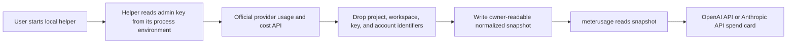

# API usage tracking beta

> **Status: Research proposal; not implemented.** meterusage does not currently fetch OpenAI API or Anthropic API organization usage or cost data.

This proposal adds provider-reported API spend to meterusage without mixing it with Codex or Claude subscription usage. It is a documentation-only research record. `README.md` and `docs/PRIVACY.md` stay unchanged until an implementation is approved and verified.

## Supported provider findings

### OpenAI API

OpenAI documents organization-level usage endpoints and an organization costs endpoint. The costs response supports time buckets and grouping fields. Access requires an organization Admin API key, which has broader authority than a project API key.

Official sources:

- [Usage API reference](https://platform.openai.com/docs/api-reference/usage)
- [Costs endpoint reference](https://platform.openai.com/docs/api-reference/usage/costs)
- [Administration overview](https://platform.openai.com/docs/api-reference/administration)

### Anthropic API

Anthropic documents organization usage and cost reports through the Admin API. The reports support time buckets and grouping by fields such as workspace and model. Access requires an organization Admin API key. Anthropic states that Priority Tier costs are not included in the cost report.

Official sources:

- [Usage and cost API](https://platform.claude.com/docs/en/manage-claude/usage-cost-api)

### Other providers

Other providers remain research candidates. They should enter this beta only when they expose a documented aggregate usage or billing API with a clear authentication contract. Per-request token fields and local price calculations are not substitutes for a provider-reported billing total.

## Proposed beta boundary

The first beta would support only OpenAI API and Anthropic API organization spend. It would be disabled by default and would not change the menu-bar label.

The beta would report:

- current UTC-month spend from the provider's cost report
- daily spend for the last seven days
- request and token totals when the provider reports them
- the last successful snapshot time
- loading, stale, unavailable, and authentication-error states

Provider cost reports would remain distinct from meterusage's locally estimated token costs. The interface must label provider-reported amounts as billing data and local calculations as estimates.

## Proposed snapshot-helper flow

The recommended beta uses a separate, short-lived local helper. The helper reads an existing Admin API key from its process environment, calls the official API, removes identifiers, and writes a normalized snapshot with owner-only file permissions. meterusage reads the snapshot and does not receive or persist the key.

The snapshot should contain only the fields needed for display and freshness checks:

- provider identity
- bucket start and end timestamps
- currency and amount
- aggregate request, input-token, output-token, and cache-token counts when available
- snapshot creation time
- schema version

The helper must not write a key, authorization header, raw provider response, organization identifier, project identifier, workspace identifier, user identifier, or API-key identifier to disk or logs.

This proposal does not define a command for supplying credentials. Any later setup documentation must preserve the current rule against asking users to paste keys into meterusage.

## Separate product identities

API billing must use identities that are separate from the existing Codex and Claude providers. Suggested display names are `OpenAI API` and `Anthropic API`.

This separation prevents an API cost snapshot from replacing or being presented as:

- Codex subscription quota
- Claude subscription activity or optional quota windows
- OpenRouter usage and account balance
- locally estimated model costs

The storage key, settings toggle, refresh status, diagnostics entry, and card must use the API-specific identity throughout the data path.

## Security and privacy constraints

Organization Admin API keys can expose organization-wide usage and cost data. The beta must treat them as high-authority credentials.

- meterusage must not provide a key-entry field.
- meterusage must not read, display, log, cache, or persist an Admin API key.
- The helper must keep the key in memory only for one fetch run.
- The helper must use documented HTTPS endpoints and reject non-success responses without writing their raw bodies to logs.
- Snapshots must exclude account, organization, project, workspace, user, and key identifiers.
- Snapshots must use owner-only file permissions and an atomic replacement write.
- Diagnostics must report provider, freshness, and error category without including request or response bodies.
- Fixtures and tests must use synthetic values.
- A future implementation requires security and privacy review before release.

The existing OpenRouter path proves that meterusage can show authenticated aggregate usage while retaining only display-safe fields. It does not remove the need for a separate review because OpenAI and Anthropic require organization-level admin credentials for these reports.

## UX concept

Each API provider would have an optional card in the popover and a separate Settings toggle. The card would lead with current-month spend, followed by a seven-day daily trend and secondary usage totals. It would always show the snapshot timestamp.

State labels should be explicit:

- `Not configured` when no snapshot exists
- `Updated <time>` for a fresh snapshot
- `Stale` when the snapshot exceeds the approved freshness threshold
- `Authentication failed` when the helper records that category
- `Unavailable` for provider, network, or malformed-snapshot failures

The beta should not show an API spend percentage unless the user can configure a budget in a later, separately approved feature.

## Deferred scope

This proposal does not include:

- direct credential storage in macOS Keychain
- a key-entry, login, or account-connection screen
- background scheduling or a launch agent
- budgets, alerts, forecasting, or invoice reconciliation
- project, workspace, model, user, or API-key breakdowns
- combined spend across providers or currency conversion
- providers without a documented aggregate cost endpoint
- changes to the menu-bar indicator

## Acceptance questions

Implementation should not start until these questions are answered:

1. Is a separate short-lived snapshot helper acceptable for the beta, or must collection run inside meterusage?
2. Where should snapshots live, and what freshness threshold should mark them stale?
3. Should the beta display provider-reported cost only, or also aggregate request and token counts?
4. Should OpenAI API and Anthropic API ship together, or should one provider validate the snapshot contract first?
5. What evidence is required to confirm that identifiers and raw responses never reach disk, diagnostics, or the UI?
6. What release label and opt-in wording make the beta status clear?

## Documentation gate

Before implementation ships, update `README.md` and `docs/PRIVACY.md` with the verified behavior, data flow, outbound requests, retained fields, credential boundary, failure states, and test evidence. Until then, those documents must continue to describe only the features that exist.
