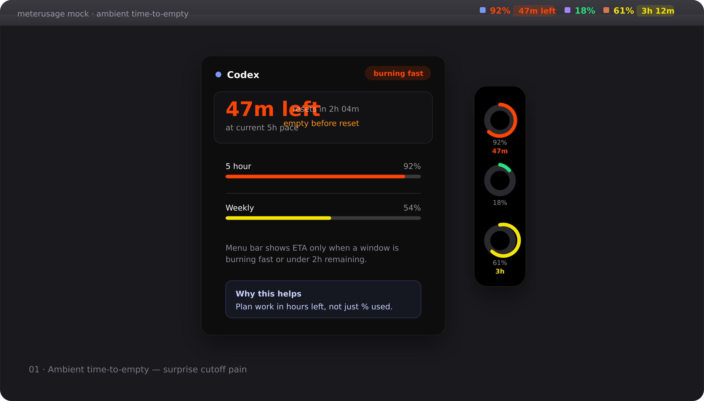

# Wave 1 — Ambient time-to-empty

> Plan work in hours left, not only percent used.

## Pain

Users hit rolling windows with little warning. `% used` alone is a poor planning signal.

## UX

- **Menu bar:** when a headline window is burning fast or under ~2h remaining, show a compact ETA chip next to that provider’s `%` (e.g. `47m left`).
- **Side notch:** ring keeps `%`; add a short ETA subtitle under the ring when relevant.
- **Hover card:** lead with a large “Xm left at current pace” banner; show reset time and whether exhaustion lands before reset.

## Provider marks

**Stay.** Use existing `ProviderMark` / logo assets. ETA is extra text beside or under the mark — never a new glyph set.

## Acceptance

- [ ] ETA uses existing pacing / `projectedExhaustion` math (no second formula).
- [ ] ETA hidden when not burning-fast and remaining time ≥ 2h.
- [ ] Demo mode can screenshot the banner + menu-bar chip.
- [ ] `swift test` green; no prompt or path leakage.

## Out of scope

Burn-by-project rows, new notification types, Windows shell.
