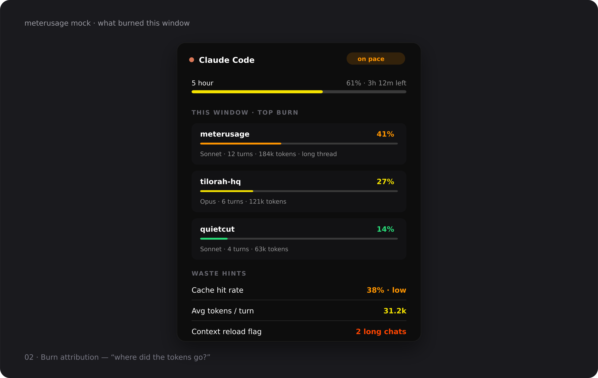

# Wave 2 — What burned this window

> Answer “where did the tokens go?” for the active quota window.

## Pain

Quota bars show that usage rose, not which project, model, or habit caused it.

## UX

- On the active window card, list **top burn contributors** (project/folder name, model, turns, token volume, share of window).
- **Waste hints** from numeric metadata only: cache hit rate, avg tokens/turn, long-chat flag.
- Privacy: final path segment only (`Privacy.projectName`); no prompts, diffs, or absolute paths.

## Provider marks

**Stay.** Card header keeps the existing provider mark. Attribution rows are text + mini bars, not new provider logos.

## Acceptance

- [ ] Ranked from local session metadata for the current window only.
- [ ] Unit tests on fixtures; zero prompt bodies in aggregates.
- [ ] Demo mode shows at least three synthetic burn rows + waste hints.
- [ ] `swift test` green.

## Out of scope

Invoice reconciliation, team attribution, always-on prompt inspection, Windows shell.
