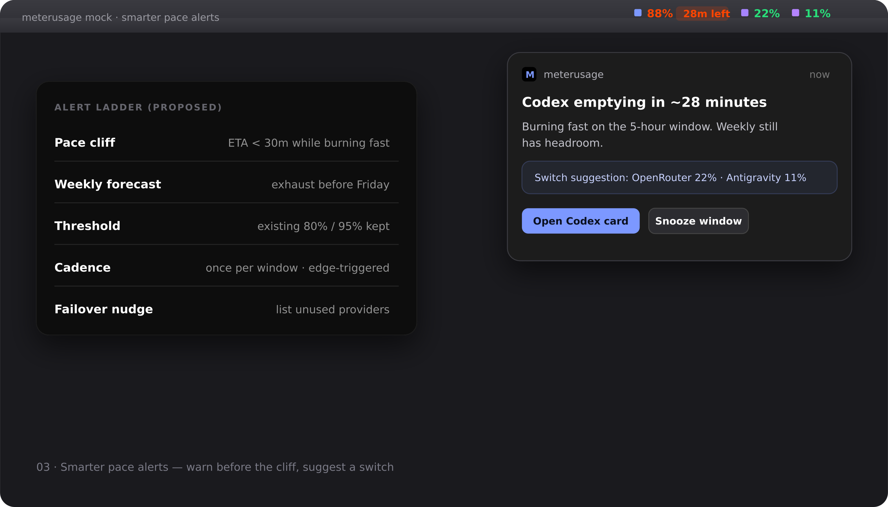

# Wave 3 — Smarter pace alerts

> Warn on time-to-empty, and point at providers that still have headroom.

## Pain

80% / 95% threshold alerts often fire too late on fast agent loops. When one tool dies, others may still have capacity.

## UX

- Keep existing 80% / 95% ladder (edge-triggered, once per window).
- Add **pace cliff**: notify when ETA &lt; ~30m while pacing is burning fast.
- Optional **weekly forecast**: on track to exhaust before the weekly reset.
- **Failover nudge** in the notification body: list other enabled providers still under ~25% used.
- Actions: open that provider’s card; snooze for the rest of the window.

## Provider marks

**Stay.** Notification and cards use existing provider names/marks. No new icon pack for alerts.

## Acceptance

- [ ] Evaluator unit tests for pace-cliff and once-per-window cadence.
- [ ] Failover list excludes the exhausted provider and disabled providers.
- [ ] Manual check in demo mode fires one notification.
- [ ] `swift test` green.

## Out of scope

Auto-switching agents between providers, team digests, Windows shell (ported later on the Windows track).
