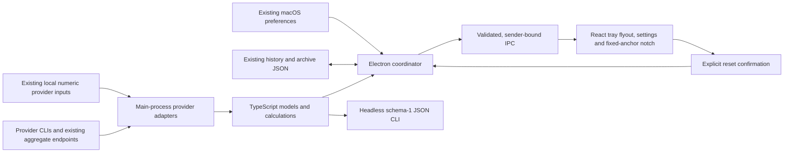

# macOS Electron migration plan

Port the macOS app and headless JSON CLI to TypeScript without changing provider or persisted-data contracts. Completion requires fixture parity and a native candidate, with each unproven native path recorded explicitly.

## Human review

### Goal

A macOS Electron app and headless CLI provide the current quota, usage, pacing, accounts, history, alerts, settings and update behavior. Windows development is paused.

### Diagram

### Approach

Use one small package: pnpm, Vite+, TypeScript, React, Tailwind and Vitest, with electron-builder for macOS candidate packaging. Main owns provider subprocesses, files, credentials, scheduling and writes. A sandboxed preload exposes named, validated operations and sanitized snapshots. The renderer has no Node access or provider paths except user-configured account directories in Settings. Reuse the existing provider marks unchanged.

Translate the Swift domain and source contracts into TypeScript, using the Swift implementation and synthetic fixtures as the parity oracle. Keep Swift source during migration as a reference and rollback path. Do not substitute a retained Swift helper for the TypeScript port. Preserve schema 1, slot identity and existing history/archive shapes, including Swift's reference-date encoding in the quota archive. Keep existing macOS preference keys and managed-account JSON data readable. Candidate QA uses isolated synthetic directories and does not read or write the installed app's data.

The owner selected Electron. The earlier React Native/Tauri and Windows-first plan is superseded. T3 Code's desktop package demonstrates the selected tools; its server, auth, networking, event sourcing, Rust monitor and Effect dependencies are unnecessary here.

### Compatibility and candidate isolation

Use a typed main-process adapter over `/usr/bin/defaults` against the original `dev.meterusage.app` domain. Read/write only known app keys. Preserve booleans/numbers/strings, update Date values and `sideNotchPanelCorner` as its existing AppKit top-right coordinates. Decode `managedAccounts` from UserDefaults Data bytes; write it with `defaults write ... -data` so Swift remains able to read it. Absent keys retain the registered Swift defaults. Synthetic-domain tests must prove old Swift preferences to Electron to Swift without using the live domain. No new preference-file migration is needed.

The exact safe candidate command is `MeterUsage.app/Contents/MacOS/meterusage --demo --candidate-profile <absolute-empty-test-directory>`. Candidate-profile selection happens before preferences, Electron userData, provider sources, archives, snapshots or caches are constructed. It uses isolated file-backed preferences, synthetic transports and reset consumers, with no network or real-home fallback. Tests reject candidate launches without demo mode. Candidate mode rejects updater installation, login-item changes and live subprocess/provider execution. Demo without a profile never writes installed-app state either.

Claude tier and transcript decoding use a selective JSON scanner: it traverses JSON syntax, materializes only schema-selected scalar values and skips unknown values without `JSON.parse` of the parent. Structural tests spy on decoded scalar values and include escaped keys, nested identifying values, unrelated message content, malformed/truncated inputs and arrays. Output projection is a separate renderer/CLI privacy gate.

### Parity inventory

| Contract | Implementation owner and proof |
| --- | --- |
| Codex | Main quota RPC, token ledger/activity, model groups, credits/reset count and explicit per-slot reset action; fixture handshake/account isolation and schema-1 comparison |
| Claude | Main companion quota, narrow plan tier and numeric transcript activity/cache; limits/legacy fixtures, per-account path isolation and selective-decoder tests |
| OpenRouter | Main aggregate key/credits/activity endpoints and existing key discovery; synthetic HTTP, optional credits failure and activity fixtures |
| OpenCode Go | Main Zen quota and read-only session SQL/CLI fallback; numeric usage/window/project fixtures and no message body selection |
| Grok | Main per-refresh token discovery, billing and summary metadata; rotated-key and date/count fixtures |
| Antigravity | Main bounded existing runtime recovery, quota groups, numeric SQLite/protobuf usage and native/container history fallback; synthetic runtime, WAL copy and protobuf fixtures |
| Cursor, Copilot, Gemini | Main existing local numeric quota candidates and presence checks; separate parser/path fixtures for each provider |
| Flyout, Settings, first run | Controller implements React surfaces and main preferences/coordinator; synthetic visibility/theme/relaunch/account/failure journey |
| Tray, notifications, login item | Controller implements Electron native shell; isolated launch and notification/login state proof where permitted; native interaction remains a named gate |
| Notch native behavior | Controller implements non-activating fixed-anchor panel, both card sides, whole-point frames, unanimated resize, folded/pinned hover/drag, release outside, display changes and persisted anchor; geometry tests plus two different-height native captures |
| Notch accessibility and sharing | Controller implements explicit detail action and card-only 2x capture with native sharing; actionable labels, correct crop and native invocation require proof |
| Updater and installer | Controller ports verified downloads and explicit-only install expectations after integrating PR51's merged source; synthetic digest/signature/copy-failure tests, no candidate install |

### What changes

The desktop shell and implementation language change. Existing features, account separation, numeric-data boundary, provider marks and compiler-free public installation remain the acceptance targets. Public installation continues to use verified prebuilt bundles. Candidate builds do not install or publish themselves.

### Risks and rollback

- Data compatibility: fixture-test old JSON and old preference values before enabling writes. Preserve unreadable history and suspend writes after a corrupt load.
- Privacy: raw provider payloads stay in main; narrow output projection and renderer import checks must reject secrets and identifying metadata. Claude tier parsing must select only tier fields rather than decode identifying values.
- Native parity: tray behavior, login item, notifications, fullscreen/spaces, drag anchoring and two different-height rendered notch cards need macOS proof. Browser screenshots cannot satisfy this gate.
- Update safety: downloads require digest and bundle/signature checks. Automatic update checks cannot install. Explicit update installation is blocked during candidate QA.
- Rollback: the existing Swift app and installer remain usable until native parity passes. JSON files retain their old format; no destructive contraction, provider-data edits or installed-app replacement is part of this change.

### Decisions needed

None for the authorized migration. Credential setup, release publication, deployment, workflow edits and installed-app replacement remain separate actions.

## Implementation plan

### Context and research

Read `AGENTS.md`, `CONTRIBUTING.md`, `docs/KB.md`, `docs/PRIVACY.md`, `docs/SIDE-NOTCH.md`, and ADRs 0002, 0003, 0004 and 0006. Source baseline is `55748e2c99e7790d09c45933f07803a4815ce6ab`, with 46 Swift sources and 31 Swift test files. Read `Services/DataSource.swift`, `Models/UsageModels.swift`, `Core/LimitsReport.swift`, `Core/CliJSON.swift`, composition, preferences, durable history and quota archive before planning.

Official Electron security guidance: https://www.electronjs.org/docs/latest/tutorial/security. Use context isolation, sandboxing, no renderer Node integration, navigation restrictions and IPC sender validation. T3 Code's desktop/web package and Vite+ configuration supplied concrete package versions and bundling patterns. The macOS host has existing Node, pnpm, Swift and codesign; no compiler installation is needed.

Installer work is separately owned in PR 51. Read its merged result before changing `Scripts/make-app.sh` and related install docs. Integrate only merged source into this existing worktree and preserve its verified prebuilt default, explicit source option and failure-safe output replacement.

### Assumptions

- Existing JSON schemas remain sufficient. Falsify by round-trip tests against Swift fixtures, including dates, missing optional fields and zero values.
- Electron APIs can implement native behavior. Falsify with candidate runtime proof; unsupported paths remain blockers, never silently dropped features.
- Authorized T3 tools can drive or capture native candidate interaction. Inspect capabilities; if they only expose web preview and mobile devices, report the exact native interaction gap and continue independent implementation/tests.
- Installer PR51 is merged and integrated. Preserve its prebuilt default and explicit source-build option.

### Steps

- [x] S1 Port models, pacing, pricing, telemetry, burn attribution, account identity, history and schema-1 JSON reports · files: `src/domain/`, `src/main/history.ts`, `tests/` · verify: `pnpm typecheck`, `pnpm test` with fixture comparisons to Swift.
- [x] S2 Port every provider's quota/activity/usage/status/plan source and composition · files: `src/main/providers/`, `src/main/composition.ts`, `tests/` · verify: `pnpm test tests/providers.test.ts tests/usage.test.ts tests/composition.test.ts` plus structural parser and transport fixtures.
- [x] S3 Port coordinator, preferences, alerts, diagnostics and explicit reset flow · files: `src/main/`, `src/shared/`, `tests/` · verify: `pnpm test tests/coordinator.test.ts tests/reset-pacing.test.ts tests/ipc.test.ts tests/domain.test.ts` for refresh/backoff, corrupt history and synthetic reset/IPC contracts.
- [ ] S4 Implement Electron main/preload and React flyout/settings/notch with existing assets · files: `src/renderer/`, `src/main/electron.ts`, `src/preload.ts`, build configuration · verify: `pnpm build`, IPC validation/import boundaries, T3 preview synthetic journey and native smoke when available.
- [ ] S5 Build macOS candidate with electron-builder using existing remote tools · files: packaging configuration and candidate smoke script · verify: `pnpm package:mac`, artifact digest and signature, headless demo JSON, native launch, settings/relaunch/offline path, two different-height notch captures and fixed top/strip positions. Record size/RSS. No installation or publication.
- [x] S6 Reconcile merged installer source and update public docs · files: README, CONTRIBUTING, CHANGELOG, KB, privacy, legacy Windows plan, new next-free-number ADR and index · verify: documentation link checks, `python3 scripts/documentation.py --check` if repository provides it, `git diff --check`; retain explicit unavailable-check evidence if absent.
- [ ] S7 Deliver the authorized change only after meaningful executed validation, exact-base/head independent review and required forge gates · verify: Ponytail review/attestation before commit/push, PR linking, app-owned watcher, expected-head guarded merge and separate remote content readback. Workflow changes and release actions remain held.

### Verification plan

Entry state: synthetic clean candidate profile, installed app untouched. Launch candidate, read all provider cards, open Settings, change theme/provider/account label, refresh and relaunch, compare retained settings/history. Inject offline, malformed and slow providers; each fails independently and shows unavailable or dated archive rather than fabricated zero/live data. Add two synthetic accounts of one provider, rename/disable/remove one and verify distinct quota/history/alerts/JSON without deleting provider files. Show reset credits, cancel confirmation, then redeem only a synthetic fixture credit once. Switch between two different-height notch cards and capture native rendered top and strip positions. JSON launch exits without a tray/window and preserves schema-1 output.

Native notifications, login item and update/install behavior require an isolated candidate-safe check or explicit missing-proof record. Do not consume live credits or replace the installed app to test them.

### Delivery and completion gates

Source-validation gate requires executed TypeScript/build/fixture parity, unchanged Swift baseline receipt or affected Swift checks, and exact-base/head independent review. Native-parity gate additionally requires a packaged candidate with bundle identifier, executable identity, digest, signature, launch/interactive user-path receipts and native notch captures. Missing native evidence leaves the migration open and prevents a parity/cutover claim; it does not prevent independent source implementation. A source-only draft PR may record unfinished gates, but guarded delivery/merge of the migration waits for required proof and holds to resolve.

Retain `MeterUsage.app`, executable `meterusage`, bundle id `dev.meterusage.app`, version/build metadata and exact updater ZIP pattern `MeterUsage-<version>.zip`. Candidate filenames/profiles must remain distinguishable without overwriting the installed bundle. Measure candidate package size, idle RSS and synthetic cold/warm scan times alongside the Swift baseline; record the observed tradeoff. The owner-selected Electron direction is standing authority for its footprint, not permission to omit behavior or invent a pass threshold. Any observed regression that breaks the existing path must be resolved before completion.

The integrated Swift baseline is `4b913db3a3a8eb2602296489872af2ecaa5d0530`. PR51 has merged; its independently reviewed tree has executed macOS `swift build` and 394 passing tests. Migration changes do not alter Swift source, tests or package inputs. Reuse this matching receipt and rerun only invalidated checks.

### Risk surface

Provider credentials and local data remain in main. Independent security review covers IPC, endpoint allowlists, subprocess arguments, narrow decoding and output projection. No new auth, billing, production or credential setup is authorized.

### Out of scope

Windows source, installers, CI, tests and releases; studio guidance and future app migrations; workflow changes, releases, deployments, OTA, store submissions, installed-app replacement, provider-data writes and live redemption.

### Review sign-off

Independent plan review round 1 requested five revisions: typed UserDefaults compatibility, enforced candidate isolation, explicit native parity inventory, structural selective parsing, and separate source/native/cutover gates. The plan now specifies each mechanism. Round 2 passed all review axes against the revised mechanisms. This is plan approval only; implementation and native proof remain open. Review completeness, strategic scope, privacy, native UI invariants, operational safety and security in one bounded pass. Existing owner authorization permits execution after concerns are resolved.

### Current execution state

S1 through S3 have synthetic fixture and TypeScript-check proof. All 119
current fixtures have matching passing execution receipts, including refreshed
affected cases and retained unchanged cases. Production renderer, main and
preload bundles build, and the rebuilt schema-1 demo matches the Swift oracle. Provider and shell
source fixes, including history projection, per-session degradation, reset visibility,
rolling shares, archive/reset status and provider/display parity, have
passing regression checks; complete source review remains
open. S4 native/T3-rendered proof and all S5 native acceptance remain open.
S6 public documentation links and whitespace pass; the repository does not
provide `scripts/documentation.py`. No Electron release,
installation or cutover has occurred. Source-only draft delivery is allowed
when its applicable checks and review pass; merge remains blocked by native
parity.

The first native candidate attempt passed symbol export, production bundling
and TypeScript checking. Its fixtures passed 90 cases and failed 29: 28 used
temporary-path aliases rejected by candidate isolation, and one assumed a
case-sensitive filesystem. Canonical fixture roots and exact directory-entry
checks now pass all 51 affected cases on Linux. Preserve the symlink guard;
the corrected macOS fixture run remains pending.

Packaging failed when the dependency collector resolved a broken pnpm
launcher. Use a candidate-local PATH alias to the verified existing executable
for the next bounded native diagnostic. No host configuration change is needed.
There is no verified candidate ZIP, signature or native UI evidence from this
attempt.
